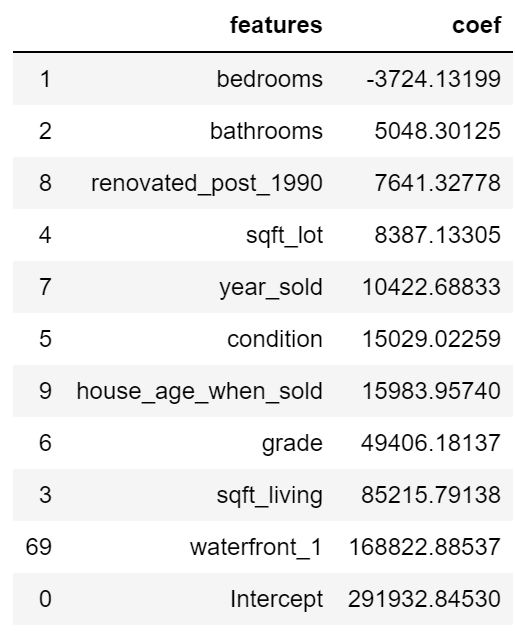

# MAXIMIZING HOUSE VALUE IN KING COUNTY

** Problem Statement:**

As a Junior Data Scientist, I have been tasked with investigating house sales in the King County area and building a model to suggest home improvements in order to increase house value.

The following questions will be answered in this project:

* Which feature generates the best model, zip codes or sub regions?

* Does transforming the target value improve model efficiency?

* Which house attributes have a high impact in sale price and which attributes have the least/negative impact?

# Components:
* **Jupyter Notebook** - A well documented Jupyter Notebook containing any code I've written for this project and comments explaining it.

* **Presentation** -  Short PowerPoint presentation, delivered as a PDF export, giving a high-level overview of your methodology and recommendations for non-technical stakeholders.

* **Blog Post** - Blog post found on this link (https://learn.co/blog/blog_posts/38434/edit)

* **Data** - King County house sales dataset named 'kc_house_data.csv' and King County subregion by zipcode named 'SubRegZipCityNeighborhood.xlsx' 

# Methodology:

On this project, the OSEMiN data science workflow was adopted.

**OBTAIN** - Understanding stakeholder requirements and sourcing data.

**SCRUB** - Identifying and removing null values, dealing with outliers, normalizing data, and feature engineering/feature selection 

**EXPLORE** - Create visualizations to really get a feel for your dataset. 

**MODEL** - Building and tuning models.

**iNTERPRET** - Interpret the results of your model(s), and communicate results to stakeholders. 

# Project Summary:

# Question 1 - Zip code vs. Sub Region.

&nbsp;

At first glance, the zip code column in the dataset seemed too complex. It was assumed that having 70 one hot-encoded zip code features would hurt the model's interpretability, so it was decided to compress all of them into 10 sub regions. Linear Regression Models were made for both options to see how having sub regions would affect the model's performance. Below are the models summaries:

 

** Sub Region Linear Regression Model Results:**

&nbsp;

&nbsp;

&nbsp;

** Zip Code Linear Regression Model Results:**

&nbsp;

&nbsp;

**Conclusion** - By using zip codes instead of sub regions, the R^2 improved drastically from 71.7% to 82.2%. This means that generalizing zip codes into regions did not help the model because there is a high price variation from city to city. Even though the zip code model has 54 extra features, they are all one hot-encoded features. The residual distributions for both models are very similar, both having difficulties with high value houses.

# Question 2 - Log Transforming Target

&nbsp;

Log transforming is used reduce or remove skewness when the original data doesn't follow a normal distribution. In statistics, it is desirable to make the as “normal” as possible so that the statistical analysis results from this data become more valid, but by doing so, the result becomes more complex. Based on this, an attempt on log transforming the target value (Price) was made. It was assumed that by doing so, it would drastically improve the model's performance. 

 

** Zip Code + Log Price Linear Regression Model Results:**

&nbsp;

&nbsp;

**Conclusion** - By log transforming the target value (Price), the interpretability of the model decreased drastically without adding too much benefit. The R^2 only increased around 1%. The best model is still the one  which uses the zip codes instead of sub regions

# Question 3 - Best and Worst Features

In order to determine which are the most and the least meaningful features, it was required to standardize the data. On previous models, we saw how each feature affected price, meaning by increasing 1 unit of that feature, it would impact the price by x number of dollars, which was determined by the coefficients. Now by standardizing the data, we will be able to see the 'weight' of each feature. Below are the sorted feature coefficients from the zip code model.

** Sorted Features (Zip Code Model):**

&nbsp;

&nbsp;

Some of the most important features in a house are being located near the waterfront, sqft living, grade, and age of the house when sold. Since only the features that can be controlled are being taken in consideration, the 'Grade' feature was analyzed further. 

&nbsp;

&nbsp;

**The average house price increases with grade indicating that these features are positively correlated.**

Some of the least important features are number of bedrooms and bathrooms, lot size, and whether the house was renovated or not.

# Conclusions and Recommendations

**Question 1**

   * By using zip codes instead of sub_regions, model performance increased drastically. That may be due to the sub region category being too broad; there may be a big price variation between zip codes within a region. Next step would be to plot house prices on a map to see how location affects the market.
    
**Question 2**

   * Log transforming did improve the model by 1%, but the extra complexity does not justify the increase. Log transformation adds some complexity to the regression model when it comes to interpreting the model's coefficients. With the target variable being log transformed, when the features change by a fixed percentage, the target will also change by a fixed percentage. A change in the features will not be equal to a fixed dollar amount. Due to this increased complexity, the regular model was chosen.

    
 **Question 3 and Recommendations**
 
   * There are certain things that can be done and certain things that should be avoided when investing into a house. 
     
     These are some recommendations if a home owner wants to increase the value of his house:
     
        1- Increase the living square footage of the house. Living square footage is worth more than lot square footage.
        
        2 - Improve the overall grade of the house. If the house is being renovated, invest in high quality materials and luxurious items. Hire an architect to create a custom design.
        
         
   * Based on the regression model's output, the following things are not recommended when the goal is to increase a house's value:
     
        1- Adding a new bedroom or bathroom to a house does not guarantee that the house's value will increase. Does not take space from the kitchen or living room in order to make a new bedroom/bathroom. Only add them if the house is being expanded.
        
        2- Renovating a house might not increase it's value. If you plan to renovate, increase the total living square footage and investing in high quality materials.
        
        3- Don't go crazy and buy a portion of your neighbor's backyard to increase your lot size. The only way that it will help you is if the lot you buy has a waterfront view.
